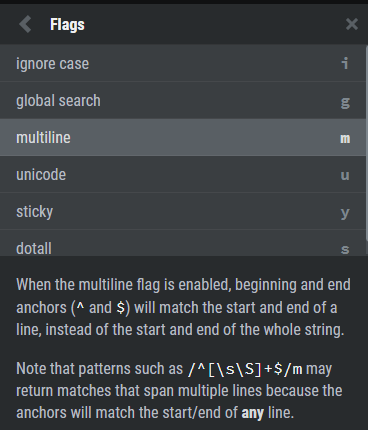
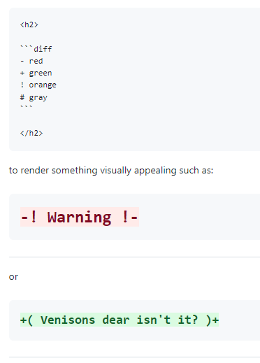

# All basics about regular expression for js

assume that we have a string string in text variable.

    let text = `Sharif md. raisul islam rafi. Rafi read in class 1. He is a intelligent, but literally he is funny boy in the #00FF00   universe --- 🤣😂. 
    He is 6 years old. He like English book ! His Favorite color is rgb(0, 255, 0) / colourrr colorr colo #00FF00`;

    let newText = text.match(/^He/gm);
    let fullData = "";
    let count = 0;

    let stringData = newText.forEach((chunk) => {
	    fullData += chunk;
    });
    console.log(fullData);

This is a simple example for the regex workflow

## Some methods and key combination for regex

1. / some expression here... / <-- we have to write the expression inside the two backslashes.
2. after the second / we can add g (global flag) and i (case instance flag)
3. global flag (/g) means it will select every possible match. In default we know that it only selects the first math. 
4. case instance flag (/i) will ignore the case facts (apple == APPLe) 
5. /\w/ here \w (small w) means it will select all the word including number but ignore all other stuff ( . , / ? ! = -_ & space )                         
6. /\W/ (big W) will select the all operator and other stuff like ( , . # - = space ) but it will not select the words and numbers
7. /\d/ (little d) will select the digit
8. /\D/ (big D) will not select the digit but will select other stuff
9. /\s/ (small s) will select the space
10. /\S/ (big S) will not select the spaces but will select other stuff
11. /\t/ (small t) will select the tab space
12. /\n/  will select the new line
13. /any word or character.../ this will select that specific word or character
14. /./gi will select everything without new line
15. /[abc]/gi will select every a, b, c from the text line. This will behave like an array
16. /[o-w]/gi this range will select all characters from o to w
17. /[W-Za-sA-P]/g will select all W-Z, a-s, A-P character sets
18. ^ this symbol is called negation.
19. /[^abc]/g this will not select a, b, c but will select all other stuff.
20. ? indicate 0 or 1 occurrence
21. /colou?r/gi$ this will select color and colour both
22. (*) indicate 0 or multiple occurrence
23. /color*/ this will select color, colo, colorrrr and colorrrr
24. /colou?r*/gi this will select color, colo, colorrrr, colorrrr, colour and colourr
25. (+) indicate 1 or multiple occurence
26. /colou?r+/ will not select colo or will select color this time because (+) will select those word which have (colorr) minimum 1 r or more
27. {n} preceding is matched exact n time
28. /colou?r{2}/gi will select colourr and colorr because there are 2 r available here
29. {min, max} this will set a range for selections
30. /colou?r{1,3}/gi this will select colourr, color , colorrr and it will not select colo this time because it is not full fil the min parameter
31. \\ is called the escape character
32. /color\?/gi will select the color? word. because here \ slash will scape the ? key word so regex consider it as a string not it's key word
33. /^Sharif/ this will check the string was start with Sharif word
34. $ this  symbol will help to identify the end character or word
35. /#00FF00$/g will select the last word if its exists
36. multiline flag (m) will select for the individual line not the whole string.
37. /^He/gm this will now find for the first word selection in new line not the whole string's first word

## Function for managing regex in js

Here we will know about some Functions 

    const text = "This is user1 phone number: +88-01712345678";
    const newNumber = "01300000234";

    const regex = /(\+88-)?01[1-9]\d{8}/g;

    // return an array of matched elements
    let matches = text.match(regex);

    // replace the selected texts with prams text
    let replacement = text.replace(regex, newNumber);

    // return the index of the searched elements
    let index = text.search(regex);
    
    // return true or false for the find result
    let test = regex.test(text);

    console.log(matches, replacement, index, test);

if we want to deal with stored variable we can use this process:

    var name = 'John';
    var regexp = new RegExp("(" + name + ")", "g");

    Example usage: 'Johnsina'.replace(regexp, '');

## Screenshots
 
Here all the necessary flags

## Here for some tips for how to color or highlight your markdown header.

